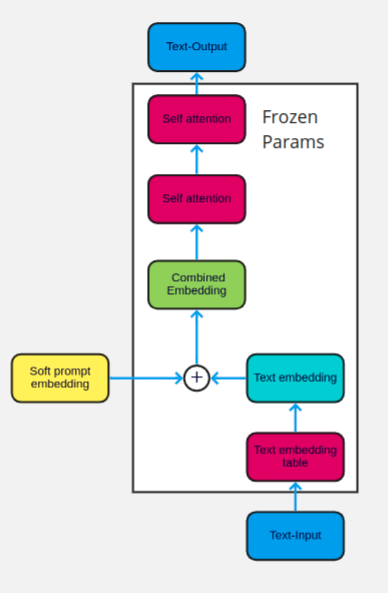

# The Power of Scale for Parameter-Efficient Prompt Tuning



Implementation of soft embeddings from https://arxiv.org/abs/2104.08691v1 using Pytorch and Huggingface transformers

# Citation

```bibtex
@misc{lester2021power,
      title={The Power of Scale for Parameter-Efficient Prompt Tuning}, 
      author={Brian Lester and Rami Al-Rfou and Noah Constant},
      year={2021},
      eprint={2104.08691},
      archivePrefix={arXiv},
      primaryClass={cs.CL}
}
```